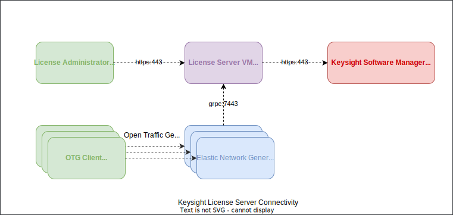

# Keysight Elastic Network Generator Licensing and Image Access

## License Editions

The following License Editions are available for Keysight Elastic Network Generator:

  | Capability                          | Community            | Developer            | Team                           | System                              |
  |-------------------------------------|----------------------|----------------------|--------------------------------|-------------------------------------|
  | Ixia-c Traffic Port Capacity        |  4 x 1/10GE          |  50GE                |  400GE                         | 800GE                               |
  | Test Concurrency                    |  1 Seat              |  1 Seat              |  8 Seats                       | 16 Seats                            |
  | Protocol Scale                      |  Restricted          |  Limited             |  Limited                       | Unlimited                           |
  | Requires a valid license            |  N                   |  Y                   |  Y                             | Y                                   |
  | Includes Ixia-c Software Test Ports |  Y                   |  Y                   |  Y                             | Y                                   |
  | Works with UHD400T Hardware         |  N                   |  N                   |  Y                             | Y                                   |
  | Works with IxOS Hardware            |  N                   |  N                   |  N                             | Y                                   |

 The **Ixia-c Traffic Port Capacity** is determined as a sum of the configured Ixia-c test port speeds with the possible values of: 100GE, 50GE, 40GE, 25GE, 10GE, and 1GE. The Maximum data plane performance of an Ixia-c port may be less than the configured port speed, depending on the capabilities of the underlying hardware and software drivers.

 The **Test seat concurrency** applies to a number of controller instances that are running with a configuration that exceeds the capabilities of the Community Edition.

 The **Restricted** protocol scale supports the maximum of 4 BGP sessions per test.

 The Capabilities of the **Limited** protocol scale depend on the protocol. For details, contact [Keysight Support](https://support.ixiacom.com/contact/support).

 Keysight Elastic Network Generator can simultaneously consume multiple licenses to increase the capabilities of a test. For example, if the Ixia-c Traffic Port Capacity configured in one test is 100GE, two Developer licenses will be consumed if available.

 If you require capabilities beyond those provided by the Community Edition, use [Keysight Elastic Network Generator](https://www.keysight.com/us/en/products/network-test/protocol-load-test/keysight-elastic-network-generator.html) product page to request an evaluation or a quote.


## License Server

Keysight uses a license server to manage floating or network shared licenses for its software products. The license server enables licenses to float and not be tied to a specific Elastic Network Generator instance. The Elastic Network Generator controllers must be able to reach the License server.

In order to use capabilities of Elastic Network Generator that require a valid license, you need to deploy a Keysight License Server. The License Server is a virtual machine and it is distributed as OVA and QCOW2 images (you only need one of them depending on your hypervisor).

* [QCOW2 image](https://storage.googleapis.com/kt-nas-images-cloud-ist/slum-4.2.0-208.qcow2), ~6GB

To make a decision where to deploy the License Server VM, take into the account the following requirements:

* For Linux-based QEMU or KVM, use the QCOW2 image
* 2 vCPU cores
* 4GB of RAM
* 100GB storage
* 1 vNIC for network connectivity. Note that DHCP is the preferred option, and this is also how the VM is configured to obtain its IP address.

Network connectivity requirements for the License Server VM

1. Internet access from the VM over HTTPS is desirable for online license activation, but not strictly required. Offline activation method is available as well.
2. Access from a user over SSH (TCP/22) for license operations (activation, deactivation, reservation, sync)
3. Access from any `ixia-c-controller` that needs a license during a test run over gRPC (TCP/7443) for license checkout and check-in

Here is an example of how different components communicate with the License Server:



## License Activation

You will now be able to activate licenses and use the License Server on your Elastic Network Generator setup. Go to `https://your-license-server-hostname` to access the application. Enter credentials: `admin`/`admin` to login.

If you have an activation code, to perform an online activation, click "Activate Licenses", enter the code and click "Activate". For offline mode, choose "Offline Operations" instead.

## Connecting Elastic Network Generator to the License Server

To connect the Elastic Network Generator controller instance to the License Server, use `--license-servers="server1 server2 server3 server4"` argument when launching the controller. An alternative way is to use an environment variable `LICENSE_SERVERS`. The argument accepts a space-separated list of hostnames or IP addresses of the License Servers, up to four. The controller will try to connect to the License Servers in the order they are specified in the list. If the first License Server is not available, or doesn't have enough available licenses to run the test, the controller will try to connect to the next one in the list.

## Access to private images on Github Container Registry

> Note: With introduction of licensing support, all the new versions of the Elastic Network Generator images are now openly published on [Open Traffic Generator Container Registry](https://github.com/orgs/open-traffic-generator/packages). The following instructions are only applicable to the older versions of the images that are still available via private access.

In order to use this method, you need a Github account. The account should be given access to private [KENG](https://www.keysight.com/us/en/products/network-test/protocol-load-test/keysight-elastic-network-generator.html) images by Keysight team. Use "Request Demo" link on [KENG](https://www.keysight.com/us/en/products/network-test/protocol-load-test/keysight-elastic-network-generator.html) page for that.

Create a new personal access token (PAT) via [https://github.com/settings/tokens/new](https://github.com/settings/tokens/new?scopes=read:packages):

* Note: ghcr.io
* Expiration: 90 days
* Scope: read:packages (should be already selected if the link above was used)

Save the token in a password manager and use it for `CR_PAT` variable below. Also, don't forget to provide your github username for `CR_USERNAME`

```Shell
CR_PAT=YOUR_TOKEN
CR_USERNAME=YOUR_USERNAME
echo $CR_PAT | docker login ghcr.io -u $CR_USERNAME --password-stdin
```

Pull KENG images to validate access (note, depending on the access provided, you might need to use a different set of images):

```Shell
docker pull ghcr.io/open-traffic-generator/licensed/ixia-c-controller:0.0.1-4013
docker pull ghcr.io/open-traffic-generator/licensed/ixia-c-protocol-engine:1.00.0.299
```
