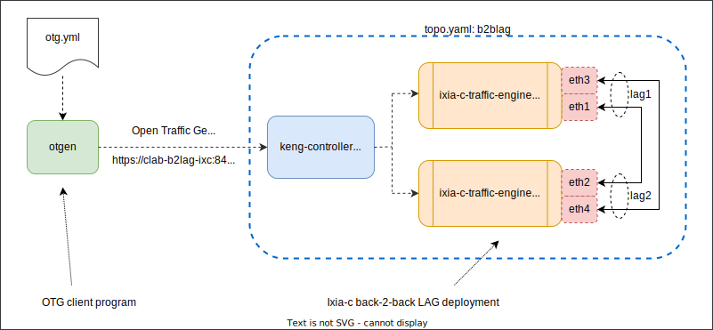

# Static B2B LAG

## Overview
In this lab two Ixia-c Traffic Engines have a pairs of traffic ports each connected back-2-back in a Containerlab environment. The goal is to demonstrate how to create a static Link Aggregation Group (LAG) consisting of two ports and run traffic over the LAG interface.



## Prerequisites

* Linux host or VM with sudo permissions and Docker support
* `git` - how to install depends on your Linux distro
* [Docker](https://docs.docker.com/engine/install/)
* [Containerlab](https://containerlab.dev/install/)

## Clone the repository

1. Clone this repository to the Linux host where you want to run the lab. Do this only once.

    ```Shell
    git clone --recurse-submodules https://github.com/open-traffic-generator/otg-examples.git
    ```

2. Navigate to the lab folder

    ```Shell
    cd otg-examples/clab/ixia-c-one-b2b-lag
    ```

## Install components

1. Install `otgen`

    ```Shell
    bash -c "$(curl -sL https://get.otgcdn.net/otgen)" -- -v 0.6.2
    ```

## Deploy a lab

```Shell
sudo -E containerlab deploy -t topo.yml
```

## Run otgen tests

1. Flow-based statistics over the LAG

    ```Shell
    otgen run --insecure --file otg.yaml --yaml --metrics flow | otgen transform --metrics flow | otgen display -m table
    ```

2. Individual port statistics showing packet distribution over the LAG members

    ```Shell
    otgen run --insecure --file otg.yaml --yaml --metrics port | otgen transform --metrics port | otgen display -m table
    ```

## Destroy the lab

```Shell
sudo -E containerlab destroy -t topo.yml
```
