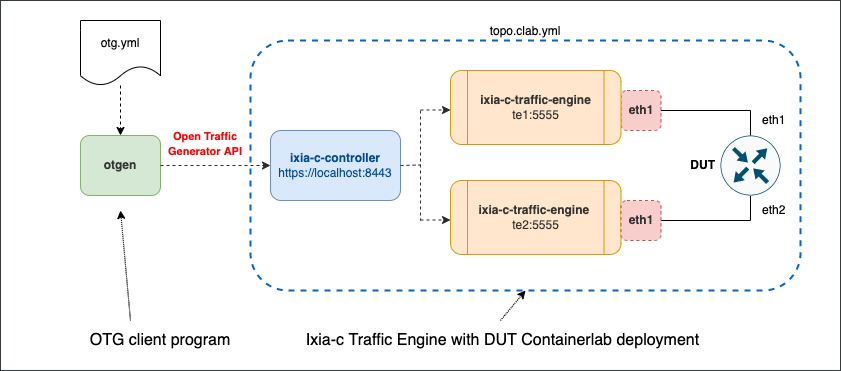
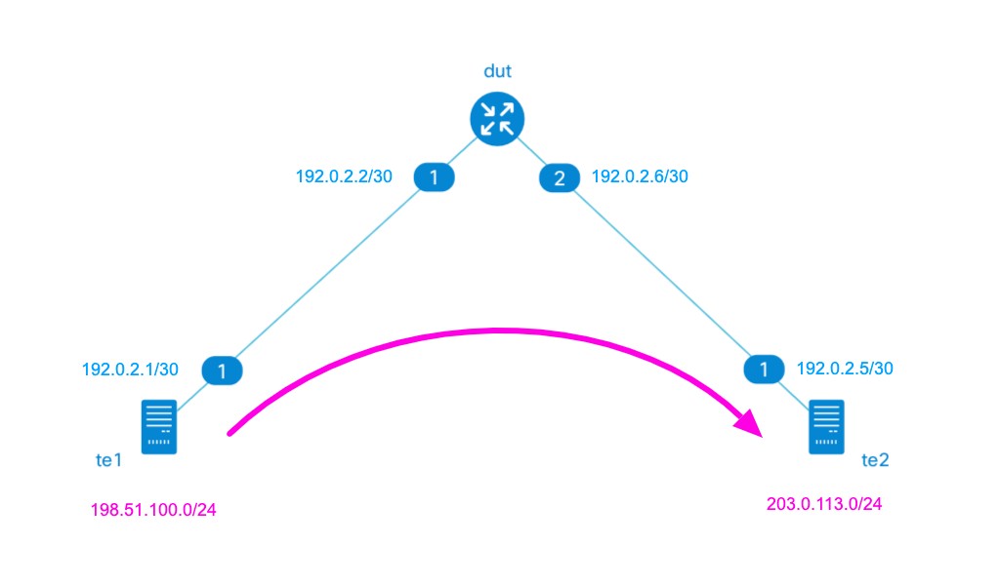

# Ixia-c Traffic Engine and FRR with Containerlab

## Overview
In this setup, we demonstrate how to deploy Ixia-c Traffic Engine nodes in Containerlab. This setup has an FRR container as a Device Under Test (DUT). Finally, we use `otgen` CLI tool to run the test and report statistics.

### Diagram



### Layer 3 topology and generated traffic flows



## Prerequisites

* Linux host or VM with sudo permissions and Docker support
* `git` - how to install depends on your Linux distro.
* [Docker](https://docs.docker.com/engine/install/)
* [Containerlab](https://containerlab.dev/install/)
* [otgen](https://github.com/open-traffic-generator/otgen)

    ```Shell
    curl -L "https://github.com/open-traffic-generator/otgen/releases/download/v0.2.0/otgen_0.2.0_$(uname -s)_$(uname -m).tar.gz" | tar xzv otgen
    sudo mv otgen /usr/local/bin/otgen
    sudo chmod +x /usr/local/bin/otgen
    ```

* Make sure `/use/local/bin` is in your `$PATH` variable (by default this is not the case on CentOS 7)

    ```Shell
    cmd=otgen
    dir=/usr/local/bin
    if ! command -v ${cmd} &> /dev/null && [ -x ${dir}/${cmd} ]; then
      echo "${cmd} exists in ${dir} but not in the PATH, updating PATH to:"
      PATH="/usr/local/bin:${PATH}"
      echo $PATH
    fi
    ```

## Clone the repository

1. Clone this repository to the Linux host where you want to run the lab. Do this only once.

```Shell
git clone https://github.com/open-traffic-generator/otg-examples.git
````

2. Navigate to the lab folder

```Shell
cd otg-examples/clab/ixia-c-te-frr
````

## Deploy a lab

```Shell
sudo containerlab deploy
````

## Run traffic

1. Read MAC addresses assigned to the nodes

```Shell
TE1SMAC=`cat clab-ixctedut/topology-data.json | jq -r '.links[0]["a"].mac'`
TE1DMAC=`cat clab-ixctedut/topology-data.json | jq -r '.links[0]["z"].mac'`
TE2SMAC=`cat clab-ixctedut/topology-data.json | jq -r '.links[1]["a"].mac'`
TE2DMAC=`cat clab-ixctedut/topology-data.json | jq -r '.links[1]["z"].mac'`
```

2. Run traffic defined in [otg.yml](otg.yml) with `otgen` tool, taking care to replace stub MAC addresses with current values

```Shell
cat otg.yml | \
sed "s/00:00:00:00:11:aa/$TE1SMAC/g" | sed "s/00:00:00:00:11:bb/$TE1DMAC/g" | \
sed "s/00:00:00:00:22:aa/$TE2SMAC/g" | sed "s/00:00:00:00:22:bb/$TE2DMAC/g" | \
otgen run -k 2>/dev/null| \
otgen transform -m port | \
otgen display -m table
````

## Destroy the lab

```Shell
sudo containerlab destroy
````
