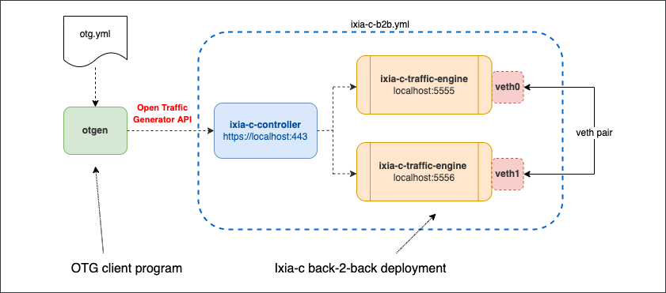

# Ixia-c traffic engine back-to-back setup with CPU Core Pinning

## Overview

This lab demonstrates how to maximize performance of [Ixia-c](https://github.com/open-traffic-generator/ixia-c) Traffic Engine ports via CPU pinning. The lab has two traffic ports connected back-2-back using a veth pair. The lab is defined via Docker Compose YAML file.



## Deployment Details

In the deployment steps listed below, two `traffic-engine` containers will be started. The table below describes parameters that are unique among them:

- **Listen Port**: Port on which the `traffic-engine` will listen to for communication with the `controller`.
- **CPU Cores Allocated**: Each instance of `traffic-engine` uses three cores. Two dedicated cores are used for  
  sending and receiving packets and one is used for configuration, control and statistics. In the example above all  
  instances of `traffic-engine` are sharing core number 2 for the configuration, control and statistics while  
  instance 1 is using cores 3/4 for Tx/Rx, instance 2 is using cores 5/6 for Tx/Rx, and so on.

| Instance | Listen Port | Cores Allocated | vEth Interface Used     |
|----------|-------------|-----------------|-------------------------|
| 1        | 5555        | 2, 3, 4         | veth0                   |
| 2        | 5556        | 2, 5, 6         | veth1                   |


**Note**: The Tx/Rx cores allocated to a `traffic-engine` instance (using the ARG_CORE_LIST environment variable)  
MUST NOT overlap across other such instances (even if they are idle and not sending/receiving any traffic).  
Sharing Tx/Rx cores will result in undefined behavior including but not limited to loss of performance.  
Further due to a NUMA-related limitation with DPDK 19.11 used by Ixia-C Traffic Engine, the core used for control  
needs to be same across all `traffic-engine` instances. In the example above, core number 2 is used for control in all three containers.


    ```Yaml
    services:
      controller:
        image: ghcr.io/open-traffic-generator/ixia-c-controller:0.0.1-3724
        command: --accept-eula --http-port 8443
        network_mode: "host"
        restart: always
      traffic_engine_1:
        image: ghcr.io/open-traffic-generator/ixia-c-traffic-engine:1.6.0.24
        network_mode: "host"
        restart: always
        privileged: true
        cpuset: 2,3,4
        environment:
        - OPT_LISTEN_PORT=5555
        - ARG_IFACE_LIST=virtual@af_packet,veth0
        - OPT_NO_HUGEPAGES=Yes
      traffic_engine_2:
        image: ghcr.io/open-traffic-generator/ixia-c-traffic-engine:1.6.0.24
        network_mode: "host"
        restart: always
        privileged: true
        cpuset: 2,5,6
        environment:
        - OPT_LISTEN_PORT=5556
        - ARG_IFACE_LIST=virtual@af_packet,veth1
        - OPT_NO_HUGEPAGES=Yes
    ```

## System Prerequisites

### CPU and RAM

* `traffic-engine` - each instance requires 2 dedicated CPU cores and 3GB dedicated RAM.
* `controller` - each instance requires at least 1 CPU core and 2GB RAM.

### Platform

* x86_64 Linux Distribution (Centos 7+ or Ubuntu 18+) with sudo permissions and Docker support
* [Docker 19+](https://docs.docker.com/engine/install/)

## Install components

1. Install `docker-compose`

    ```Shell
    sudo curl -L "https://github.com/docker/compose/releases/download/1.29.2/docker-compose-$(uname -s)-$(uname -m)" -o /usr/local/bin/docker-compose
    sudo chmod +x /usr/local/bin/docker-compose
    ```

2. Install `otgen`

    ```Shell
    curl -L "https://github.com/open-traffic-generator/otgen/releases/download/v0.2.0/otgen_0.2.0_$(uname -s)_$(uname -m).tar.gz" | tar xzv otgen
    sudo mv otgen /usr/local/bin/otgen
    sudo chmod +x /usr/local/bin/otgen
    ```

3. Make sure `/usr/local/bin` is in your `$PATH` variable (by default this is not the case on CentOS 7)

    ```Shell
    cmd=docker-compose
    dir=/usr/local/bin
    if ! command -v ${cmd} &> /dev/null && [ -x ${dir}/${cmd} ]; then
      echo "${cmd} exists in ${dir} but not in the PATH, updating PATH to:"
      PATH="/usr/local/bin:${PATH}"
      echo $PATH
    fi
    ```

4. Clone this repository (optional, only needed to use `make all` to run all the steps automatically)

    ```Shell
    git clone --recursive https://github.com/open-traffic-generator/otg-examples.git
    cd otg-examples/docker-compose/b2b-pinning
    ```

## Deploy Ixia-c lab

1. Create veth pair `veth0 - veth1`

    ```Shell
    sudo ip link add name veth0 type veth peer name veth1
    sudo ip link set dev veth0 up
    sudo ip link set dev veth1 up
    ```

2. Launch the deployment

    ```Shell
    sudo docker-compose up -d 
    ```

4. Make sure you have all three containers running, check CPU pinning

    ```Shell
    sudo docker ps
    docker logs cpupin_traffic_engine_1_1 2>&1 | grep cores
    docker logs cpupin_traffic_engine_2_1 2>&1 | grep cores
    ```

## Run OTG traffic flows

1. Download an example of OTG traffic flow configuration file:

    ```Shell
    wget https://raw.githubusercontent.com/open-traffic-generator/otg-examples/main/docker-compose/b2b/otg.yml
    ```

2. Start with using `otgen` to request Ixia-c to run traffic flows defined in `otg.yml`. If successful, the result will come as OTG port metrics in JSON format

    ```Shell
    cat otg.yml | otgen run -k -a https://localhost:8443
    ```

3. You can now repeat this exercise, but transform output to a table

    ```Shell
    cat otg.yml | otgen run -k -a https://localhost:8443 | otgen transform -m port | otgen display -m table
    ```

4. The same, but with flow metrics

    ```Shell
    cat otg.yml | otgen run -k -a https://localhost:8443 -m flow | otgen transform -m flow | otgen display -m table
    ```

5. The same, but with byte instead of frame count (only receive stats are reported)

    ```Shell
    cat otg.yml | otgen run -k -a https://localhost:8443 -m flow | otgen transform -m flow -c bytes | otgen display -m table
    ```

6. Now report packet per second rate, as a line chart (end with `Crtl-c`)

    ```Shell
    cat otg.yml | otgen run -k -a https://localhost:8443 -m flow | otgen transform -m flow -c pps | otgen display -m chart
    ```

## Destroy the lab

To destroy the lab, including veth pair, use:

```Shell
docker-compose down
sudo ip link del name veth0 type veth peer name veth1
```

## Credits

* [Diana Galan](https://github.com/dgalan-xxia) is an author of `compose.yml` example.
