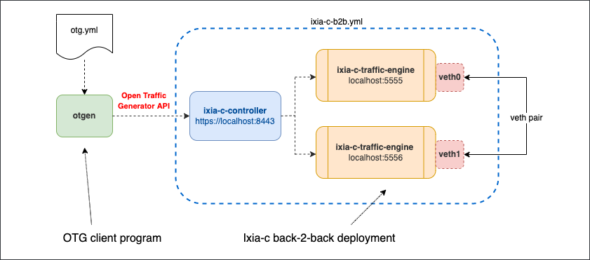

# Ixia-c traffic engine back-to-back setup with Docker Compose

## Overview
This is a basic lab where [Ixia-c](https://github.com/open-traffic-generator/ixia-c) has two traffic ports connected back-2-back using a veth pair. The lab is defined via Docker Compose YAML file. Once the lab is up, a CLI tool [`otgen`](https://github.com/open-traffic-generator/otgen) is used to request Ixia-c to generate traffic and report statistics.



## Prerequisites

* Linux host or VM with sudo permissions and Docker support
* [Docker](https://docs.docker.com/engine/install/)
* Python3.9 for `snappi` part

## Install components

1. Install `docker-compose`

    ```Shell
    sudo curl -L "https://github.com/docker/compose/releases/download/1.29.2/docker-compose-$(uname -s)-$(uname -m)" -o /usr/local/bin/docker-compose
    sudo chmod +x /usr/local/bin/docker-compose
    ```

2. Install `otgen`

    ```Shell
    bash -c "$(curl -sL https://get.otgcdn.net/otgen)" -- -v 0.4.0
    ```

3. Make sure `/usr/local/bin` is in your `$PATH` variable (by default this is not the case on CentOS 7)

    ```Shell
    cmd=docker-compose
    dir=/usr/local/bin
    if ! command -v ${cmd} &> /dev/null && [ -x ${dir}/${cmd} ]; then
      echo "${cmd} exists in ${dir} but not in the PATH, updating PATH to:"
      PATH="/usr/local/bin:${PATH}"
      echo $PATH
    fi
    ```

4. Clone this repository (optional, only needed to use `make all` to run all the steps automatically)

    ```Shell
    git clone --recursive https://github.com/open-traffic-generator/otg-examples.git
    cd otg-examples/docker-compose/b2b
    ```

## Deploy Ixia-c lab

1. Create veth pair `veth0 - veth1`

    ```Shell
    sudo ip link add name veth0 type veth peer name veth1
    sudo ip link set dev veth0 up
    sudo ip link set dev veth1 up
    sudo sysctl net.ipv6.conf.veth0.disable_ipv6=1
    sudo sysctl net.ipv6.conf.veth1.disable_ipv6=1
    ```

2. Create YAML file for Docker Compose with veth interfaces assigned to `ixia-c-traffic-engine` containers

    ```Shell
    cat > compose.yml << EOF
    services:
      controller:
        image: ghcr.io/open-traffic-generator/ixia-c-controller:0.0.1-3724
        command: --accept-eula --http-port 8443
        network_mode: "host"
        restart: always
      traffic_engine_1:
        image: ghcr.io/open-traffic-generator/ixia-c-traffic-engine:1.6.0.24
        network_mode: "host"
        restart: always
        privileged: true
        environment:
        - OPT_LISTEN_PORT=5555
        - ARG_IFACE_LIST=virtual@af_packet,veth0
        - OPT_NO_HUGEPAGES=Yes
      traffic_engine_2:
        image: ghcr.io/open-traffic-generator/ixia-c-traffic-engine:1.6.0.24
        network_mode: "host"
        restart: always
        privileged: true
        environment:
        - OPT_LISTEN_PORT=5556
        - ARG_IFACE_LIST=virtual@af_packet,veth1
        - OPT_NO_HUGEPAGES=Yes
    EOF
    ```

3. Launch the deployment and adjust MTUs on the veth pair

    ```Shell
    sudo docker-compose up -d
    sudo ip link set veth0 mtu 9500
    sudo ip link set veth1 mtu 9500
    ```

4. Make sure you have all three containers running:

    ```Shell
    sudo docker ps
    ```

## Run OTG traffic flows with `otgen` tool

1. Download an example of OTG traffic flow configuration file:

    ```Shell
    wget https://raw.githubusercontent.com/open-traffic-generator/otg-examples/main/docker-compose/b2b/otg.yml
    ```

2. Start with using `otgen` to request Ixia-c to run traffic flows defined in `otg.yml`. If successful, the result will come as OTG port metrics in JSON format

    ```Shell
    cat otg.yml | otgen run -k -a https://localhost:8443
    ```

3. You can now repeat this exercise, but transform output to a table

    ```Shell
    cat otg.yml | otgen run -k -a https://localhost:8443 | otgen transform -m port | otgen display -m table
    ```

4. The same, but with flow metrics

    ```Shell
    cat otg.yml | otgen run -k -a https://localhost:8443 -m flow | otgen transform -m flow | otgen display -m table
    ```

5. The same, but with byte instead of frame count (only receive stats are reported)

    ```Shell
    cat otg.yml | otgen run -k -a https://localhost:8443 -m flow | otgen transform -m flow -c bytes | otgen display -m table
    ```

6. Now report packet per second rate, as a line chart (end with `Crtl-c`)

    ```Shell
    cat otg.yml | otgen run -k -a https://localhost:8443 -m flow | otgen transform -m flow -c pps | otgen display -m chart
    ```

## Run OTG traffic flows with Python `snappi` library

1. Setup virtualenv for Python

    ```Shell
    python3.9 -m venv venv
    source venv/bin/activate
    pip install -r requirements.txt
    ```

2. Run snappi script

    ```Shell
    ./snappi/otg-flows.py
    ```

## Destroy the lab

To destroy the lab, including veth pair, use:

```Shell
docker-compose down
sudo ip link del name veth0 type veth peer name veth1
```

