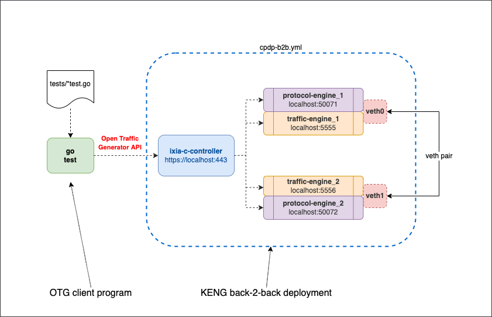

# KENG back-to-back BGP and traffic setup with Docker Compose

## Overview
This is an extended version of a basic [Ixia-c back-2-back lab](../b2b/README.md) with [Keysight Elastic Network Generator](https://www.keysight.com/us/en/products/network-test/protocol-load-test/keysight-elastic-network-generator.html) components added to emulate L2-3 protocols like BGP. In this lab, [Ixia-c](https://github.com/open-traffic-generator/ixia-c) has two traffic ports connected back-2-back using a veth pair. In addition, two protocol engines share network namespaces with respective traffic ports. The lab is defined via Docker Compose YAML file. Once the lab is up, a test Go package is used to request KENG to bring up a BGP session between two ports, generate traffic and report statistics.



## Prerequisites

* Licensed [Keysight Elastic Network Generator](https://www.keysight.com/us/en/products/network-test/protocol-load-test/keysight-elastic-network-generator.html) images. Read more in [KENG.md](/KENG.md)
* Linux host or VM with sudo permissions and Docker support
* [Docker](https://docs.docker.com/engine/install/)
* [Go](https://go.dev/dl/)

## Install components

1. Install `docker-compose`

    ```Shell
    sudo curl -L "https://github.com/docker/compose/releases/download/1.29.2/docker-compose-$(uname -s)-$(uname -m)" -o /usr/local/bin/docker-compose
    sudo chmod +x /usr/local/bin/docker-compose
    ```

2. Make sure `/usr/local/bin` is in your `$PATH` variable (by default this is not the case on CentOS 7)

    ```Shell
    cmd=docker-compose
    dir=/usr/local/bin
    if ! command -v ${cmd} &> /dev/null && [ -x ${dir}/${cmd} ]; then
      echo "${cmd} exists in ${dir} but not in the PATH, updating PATH to:"
      PATH="/usr/local/bin:${PATH}"
      echo $PATH
    fi
    ```

1. Clone this repository

    ```Shell
    git clone --recursive https://github.com/open-traffic-generator/otg-examples.git
    ```

## Deploy Ixia-c lab

1. Launch the deployment

    ```Shell
    cd otg-examples/docker-compose/cpdp-b2b
    sudo -E docker-compose up -d
    sudo docker ps
    ```

2. Make sure you have all five containers running. The result should look like this

    ```Shell
    CONTAINER ID   IMAGE                                                              COMMAND                  CREATED         STATUS         PORTS                                                                                      NAMES
    dab2f9d29434   ghcr.io/open-traffic-generator/ixia-c-protocol-engine:1.00.0.337   "/docker_im/opt/Ixia…"   4 seconds ago   Up 3 seconds                                                                                              cpdp-b2b_protocol_engine_2_1
    8873ac870684   ghcr.io/open-traffic-generator/ixia-c-protocol-engine:1.00.0.337   "/docker_im/opt/Ixia…"   4 seconds ago   Up 3 seconds                                                                                              cpdp-b2b_protocol_engine_1_1
    233b263b4326   ghcr.io/open-traffic-generator/ixia-c-traffic-engine:1.6.0.85      "./entrypoint.sh"        4 seconds ago   Up 3 seconds   0.0.0.0:5555->5555/tcp, :::5555->5555/tcp, 0.0.0.0:50071->50071/tcp, :::50071->50071/tcp   cpdp-b2b_traffic_engine_1_1
    4ae7a8fb0db6   ghcr.io/open-traffic-generator/ixia-c-traffic-engine:1.6.0.85      "./entrypoint.sh"        4 seconds ago   Up 3 seconds   0.0.0.0:5556->5556/tcp, :::5556->5556/tcp, 0.0.0.0:50072->50071/tcp, :::50072->50071/tcp   cpdp-b2b_traffic_engine_2_1
    d9d546ef3b89   ghcr.io/open-traffic-generator/keng-controller:0.1.0-3             "./bin/controller --…"   4 seconds ago   Up 4 seconds                                                                                              cpdp-b2b_controller_1
    ```

3. Interconnect traffic engine containers via a veth pair

    ```Shell
    sudo ../../utils/connect_containers_veth.sh cpdp-b2b_traffic_engine_1_1 cpdp-b2b_traffic_engine_2_1 veth0 veth1
    ```

4. Check traffic and protocol engine logs to see if they picked up veth interfaces

    ```Shell
    sudo docker logs cpdp-b2b_traffic_engine_1_1
    sudo docker logs cpdp-b2b_traffic_engine_2_1
    sudo docker logs cpdp-b2b_protocol_engine_1_1
    sudo docker logs cpdp-b2b_protocol_engine_2_1
    ```

## Run test package

```Shell
cd tests
go test -run TestIPv4BGPRouteInstall
cd ..
```

## Destroy the lab

To destroy the lab, including veth pair, use:

```Shell
docker-compose down
```

## Credits

* `connect_containers_veth.sh` copyright of [Levente Csikor](https://github.com/cslev/add_veth_to_docker/), with modifications to replace `ifconfig` with `ip link`.
