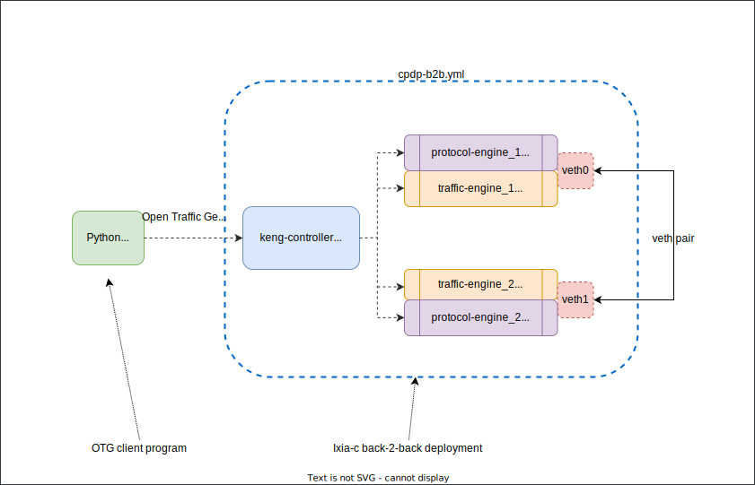

# Ixia-c back-to-back BGP and traffic setup with Docker Compose

## Overview
This is an extended version of a basic [Ixia-c back-2-back lab](../b2b/README.md) with Ixia-c Protocol Engine added to emulate L2-3 protocols like BGP. In this lab, [Ixia-c](https://github.com/open-traffic-generator/ixia-c) has two traffic ports connected back-2-back using a veth pair. In addition, two protocol engines share network namespaces with respective traffic ports. The lab is defined via Docker Compose YAML file. Once the lab is up, a test Go package is used to request Ixia-c to bring up a BGP session between two ports, generate traffic and report statistics.



## Prerequisites

* Linux host or VM with sudo permissions and Docker support
* [Docker](https://docs.docker.com/engine/install/)
* [Go](https://go.dev/dl/)

## Install components

1. Clone this repository

    ```Shell
    git clone --recursive https://github.com/open-traffic-generator/otg-examples.git
    ```

## Deploy Ixia-c lab

1. Launch the deployment

    ```Shell
    cd otg-examples/docker-compose/cpdp-b2b
    sudo docker compose up -d
    sudo docker ps
    ```

2. Make sure you have all five containers running. The result should look like this

    ```Shell
    CONTAINER ID   IMAGE                                                              COMMAND                  CREATED         STATUS          PORTS                                                                                      NAMES
    7168dfa86bc3   ghcr.io/open-traffic-generator/ixia-c-protocol-engine:1.00.0.337   "/docker_im/opt/Ixia…"   6 minutes ago   Up 6 minutes                                                                                               cpdp-b2b-protocol_engine_2-1
    dc798be3cdd6   ghcr.io/open-traffic-generator/ixia-c-protocol-engine:1.00.0.337   "/docker_im/opt/Ixia…"   6 minutes ago   Up 6 minutes                                                                                               cpdp-b2b-protocol_engine_1-1
    1cf8508108db   ghcr.io/open-traffic-generator/ixia-c-traffic-engine:1.6.0.85      "./entrypoint.sh"        6 minutes ago   Up 42 seconds   0.0.0.0:5555->5555/tcp, :::5555->5555/tcp, 0.0.0.0:50071->50071/tcp, :::50071->50071/tcp   cpdp-b2b-traffic_engine_1-1
    7dbb2f28375a   ghcr.io/open-traffic-generator/ixia-c-traffic-engine:1.6.0.85      "./entrypoint.sh"        6 minutes ago   Up 42 seconds   0.0.0.0:5556->5556/tcp, :::5556->5556/tcp, 0.0.0.0:50072->50071/tcp, :::50072->50071/tcp   cpdp-b2b-traffic_engine_2-1
    b62dd5ccc6f8   ghcr.io/open-traffic-generator/keng-controller:0.1.0-3             "./bin/controller --…"   6 minutes ago   Up 6 minutes                                                                                               cpdp-b2b-controller-1
    ```

3. Interconnect traffic engine containers via a veth pair

    ```Shell
    sudo bash ../../utils/connect_containers_veth.sh cpdp-b2b-traffic_engine_1-1 cpdp-b2b-traffic_engine_2-1 veth0 veth1
    ```

4. Check traffic and protocol engine logs to see if they picked up veth interfaces

    ```Shell
    sudo docker logs cpdp-b2b-traffic_engine_1-1
    sudo docker logs cpdp-b2b-traffic_engine_2-1
    sudo docker logs cpdp-b2b-protocol_engine_1-1
    sudo docker logs cpdp-b2b-protocol_engine_2-1
    ```

## Run OTG traffic flows with Python `snappi` library

1. Setup virtualenv for Python

    ```Shell
    mkdir -p $HOME/.venv
    python3.9 -m venv $HOME/.venv/snappi
    source $HOME/.venv/snappi/bin/activate
    pip install -r snappi/requirements.txt
    pip install -r snappi/conformance/requirements.txt
    ```

2. Run BGP B2B test

    ```Shell
    python ./snappi/otg_bgp_b2b.py
    ```

## Destroy the lab

To destroy the lab, including veth pair, use:

```Shell
sudo docker compose down
```

## Credits

* `connect_containers_veth.sh` copyright of [Levente Csikor](https://github.com/cslev/add_veth_to_docker/), with modifications to replace `ifconfig` with `ip link`.
