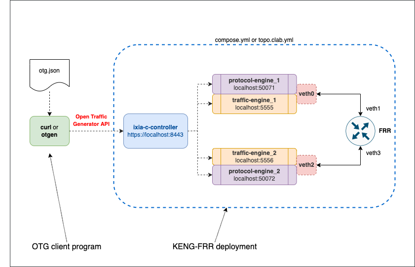
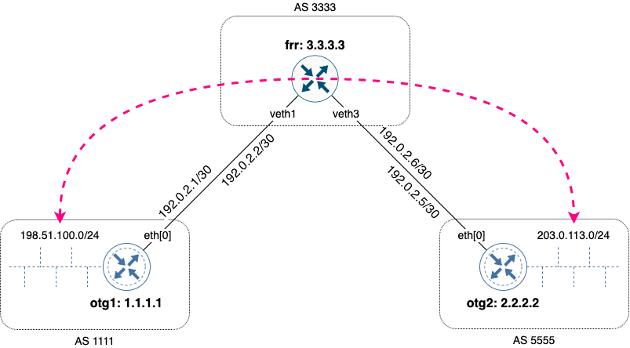
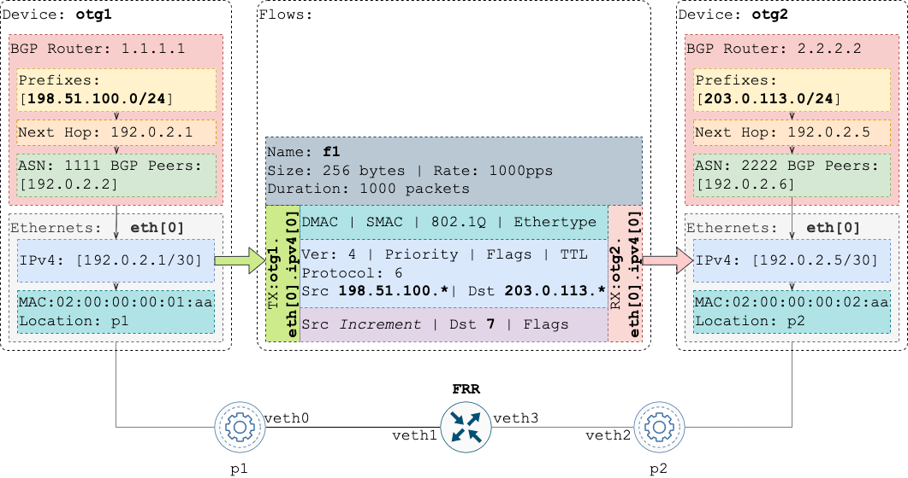

# KENG ARP, BGP and traffic with FRR as a DUT

## Overview
This lab demonstrates validation of an FRR DUT for basic BGP peering, prefix announcements and passing of traffic between announced subnets. To run OTG protocols and flows, [Keysight Elastic Network Generator](https://www.keysight.com/us/en/products/network-test/protocol-load-test/keysight-elastic-network-generator.html) is used. 

The same setup can be brought up using one of two methods:

  * Docker Compose
  * Containerlab

Also, the same OTG test logic can be executed using one of two OTG clients:

  * [`curl`](https://otg.dev/clients/curl/)
  * [`otgen`](https://otg.dev/clients/otgen/)

Each method has its own benefits. With `curl`, you can try each individual OTG API call needed to complete the test. On the other hand, `otgen` demonstrates how all these steps could be easily executed with a single command. By comparing with `curl` `get_metrics` or `get_state` requests output, you can better understands the logic `otgen` is using to wait for the results of previous API calls to converge or finish. Finally, you can use [`otgen run`](https://github.com/open-traffic-generator/otgen/blob/main/cmd/run.go) source code as a starting point for custom test logic you could develop using [`gosnappi`](https://otg.dev/clients/gosnappi/) library.

## Lab configuration

### Diagram



### Layer 3 topology and generated traffic flows



### OTG

The lab uses [`otg.json`](otg.json) configuration file with the following properties:



To request KENG to use ARP to determine destination MAC address for a flow `f1`, the following flow properties are used. The `dst` parameter in the `packet` section uses `auto` mode. In addition, `tx_rx` section has to use names of emulated devices' IP interfaces, as in `"tx_names":  ["otg1.eth[0].ipv4[0]"]`.

```JSON
  "flows":  [
    {
      "tx_rx":  {
        "choice":  "device",
        "device":  {
          "mode":  "mesh",
          "tx_names":  [
            "otg1.eth[0].ipv4[0]"
          ],
          "rx_names":  [
            "otg2.eth[0].ipv4[0]"
          ]
        }
      },
      "packet":  [
        {
          "choice":  "ethernet",
          "ethernet":  {
            "dst":  {
              "choice":  "auto",
              "auto":  "00:00:00:00:00:00"
            },
            "src":  {
              "choice":  "value",
              "value":  "02:00:00:00:01:aa"
            }
          }
        },
    }
  ]
```

## Quick start

To run all the steps below at once, use 

```Shell
git clone https://github.com/open-traffic-generator/otg-examples.git
cd otg-examples/docker-compose/cpdp-frr
make all
```

To destroy the lab, use `make clean`.

## Prerequisites

* Licensed [Keysight Elastic Network Generator](https://www.keysight.com/us/en/products/network-test/protocol-load-test/keysight-elastic-network-generator.html) images. Read more in [KENG.md](/KENG.md)
* Linux host or VM with sudo permissions and Docker support
* [Docker](https://docs.docker.com/engine/install/)
* `curl` command
* `watch` command

## Install components

1. Install `docker-compose` and add yourself to `docker` group. Logout for group changes to take effect

```Shell
sudo curl -L "https://github.com/docker/compose/releases/download/1.29.2/docker-compose-$(uname -s)-$(uname -m)" -o /usr/local/bin/docker-compose
sudo chmod +x /usr/local/bin/docker-compose
sudo usermod -aG docker $USER
logout
```

2. Make sure `/usr/local/bin` is in your `$PATH` variable (by default this is not the case on CentOS 7)

```Shell
cmd=docker-compose
dir=/usr/local/bin
if ! command -v ${cmd} &> /dev/null && [ -x ${dir}/${cmd} ]; then
  echo "${cmd} exists in ${dir} but not in the PATH, updating PATH to:"
  PATH="/usr/local/bin:${PATH}"
  echo $PATH
fi
```

3. Clone this repository

```Shell
git clone https://github.com/open-traffic-generator/otg-examples.git
```

## Deploy Ixia-c lab

1. Launch the deployment

```Shell
cd otg-examples/docker-compose/cpdp-frr
docker-compose up -d 
sudo docker ps
```

2. Make sure you have all five containers running. The result should look like this
  
```Shell
CONTAINER ID   IMAGE                                                                       COMMAND                  CREATED              STATUS              PORTS                                                                                      NAMES
22c439d4f632   ghcr.io/open-traffic-generator/licensed/ixia-c-protocol-engine:1.00.0.236   "/docker_im/opt/Ixia…"   About a minute ago   Up About a minute                                                                                              cpdp-frr_protocol_engine_1_1
3d4bc47b027d   ghcr.io/open-traffic-generator/licensed/ixia-c-protocol-engine:1.00.0.236   "/docker_im/opt/Ixia…"   About a minute ago   Up About a minute                                                                                              cpdp-frr_protocol_engine_2_1
11314fa39cd1   frrouting/frr:v8.2.2                                                        "/sbin/tini -- /usr/…"   About a minute ago   Up About a minute                                                                                              cpdp-frr_frr_1
4ede5943c0b5   ghcr.io/open-traffic-generator/licensed/ixia-c-controller:0.0.1-3587        "./bin/controller --…"   About a minute ago   Up About a minute                                                                                              cpdp-frr_controller_1
3e31f665741c   ghcr.io/open-traffic-generator/ixia-c-traffic-engine:1.6.0.19               "./entrypoint.sh"        About a minute ago   Up About a minute   0.0.0.0:5556->5556/tcp, :::5556->5556/tcp, 0.0.0.0:50072->50071/tcp, :::50072->50071/tcp   cpdp-frr_traffic_engine_2_1
b0dcff8f14be   ghcr.io/open-traffic-generator/ixia-c-traffic-engine:1.6.0.19               "./entrypoint.sh"        About a minute ago   Up About a minute   0.0.0.0:5555->5555/tcp, :::5555->5555/tcp, 0.0.0.0:50071->50071/tcp, :::50071->50071/tcp   cpdp-frr_traffic_engine_1_1
```

3. Interconnect traffic engine containers via a veth pair

```Shell
sudo ../../utils/connect_containers_veth.sh cpdp-frr_traffic_engine_1_1 cpdp-frr_frr_1 veth0 veth1
sudo ../../utils/connect_containers_veth.sh cpdp-frr_traffic_engine_2_1 cpdp-frr_frr_1 veth2 veth3
````

4. Check traffic and protocol engine logs to see if they picked up veth interfaces

```Shell
sudo docker logs cpdp-frr_traffic_engine_1_1
sudo docker logs cpdp-frr_traffic_engine_2_1
sudo docker logs cpdp-frr_protocol_engine_1_1
sudo docker logs cpdp-frr_protocol_engine_2_1
```

## Run tests

1. Apply config

```Shell
OTG_HOST="https://localhost"
curl -k "${OTG_HOST}/config" \
    -H "Content-Type: application/json" \
    -d @otg.json
```

2. Start protocols

```Shell
curl -k "${OTG_HOST}/control/protocols" \
    -H  "Content-Type: application/json" \
    -d '{"state": "start"}'
```

3. Fetch ARP table

```Shell
curl -sk "${OTG_HOST}/results/states" \
    -X POST \
    -H  'Content-Type: application/json' \
    -d '{ "choice": "ipv4_neighbors" }'
```

4. Fetch BGP metrics (stop with `Ctrl-c`)

```Shell
watch -n 1 "curl -sk \"${OTG_HOST}/results/metrics\" \
    -X POST \
    -H  'Content-Type: application/json' \
    -d '{ \"choice\": \"bgpv4\" }'"
```

5. Fetch BGP prefix announcements - TODO this doesn't show the actual announcements

```Shell
curl -sk "${OTG_HOST}/results/states" \
    -X POST \
    -H  'Content-Type: application/json' \
    -d '{ "choice": "bgp_prefixes" }'
```

6. Start transmitting flows

```Shell
curl -sk "${OTG_HOST}/control/transmit" \
    -H  "Content-Type: application/json" \
    -d '{"state": "start"}'
```

7. Fetch flow metrics (stop with `Ctrl-c`)

```Shell
watch -n 1 "curl -sk \"${OTG_HOST}/results/metrics\" \
    -X POST \
    -H  'Content-Type: application/json' \
    -d '{ \"choice\": \"flow\" }'"
```

8. Fetch port metrics

```Shell
curl -sk "${OTG_HOST}/results/metrics" \
    -X POST \
    -H  'Content-Type: application/json' \
    -d '{ "choice": "port" }'
```

## Destroy the lab

To destroy the lab, including veth pair, use:

```Shell
docker-compose down
````

## Credits

* `connect_containers_veth.sh` copyright of [Levente Csikor](https://github.com/cslev/add_veth_to_docker/), with modifications to replace `ifconfig` with `ip link`.
