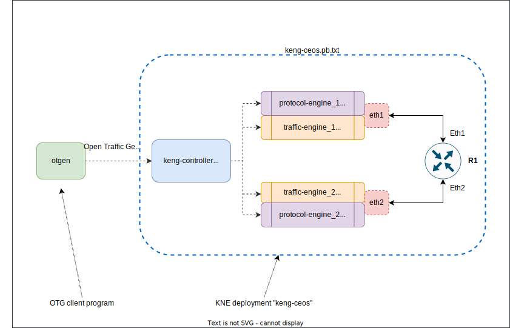
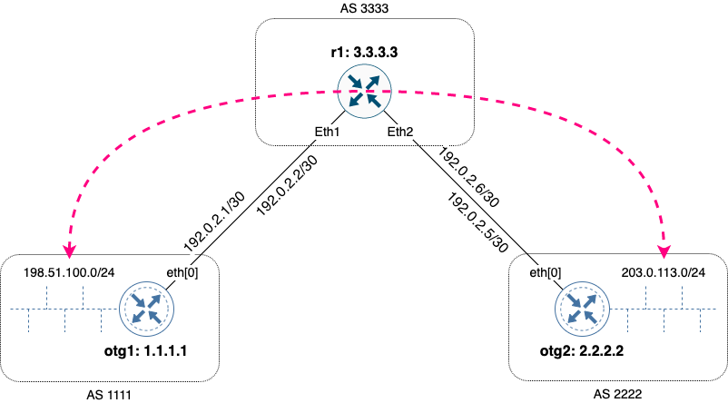
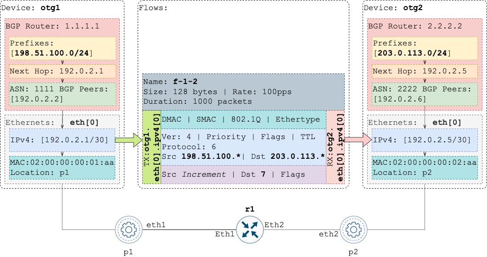

# KNE Lab with BGP and traffic via Arista cEOSLab as a DUT

## Overview
This lab demonstrates validation of Arista cEOSLab DUT for basic BGP peering, prefix announcements and passing of traffic between announced subnets. To run OTG protocols and flows, [Keysight Elastic Network Generator](https://www.keysight.com/us/en/products/network-test/protocol-load-test/keysight-elastic-network-generator.html) Community Edition with Ixia-c test ports is used.

To run the lab, OpenConfig KNE is used on top of a KIND cluster – K8s environment running inside a single Docker container.

  * [OpenConfig KNE](https://github.com/openconfig/kne/blob/main/docs/README.md)
  * [KIND](https://kind.sigs.k8s.io/)

OTG test logic is executed using `otgen` CLI client running in a dedicated K8s POD:

  * [`otgen`](https://otg.dev/clients/otgen/)

## Lab configuration

### Diagram



### Layer 3 topology and generated traffic flows



### OTG

The lab uses OTG configuration created by `otgen` with the following properties:



## Prerequisites

* Arista cEOSLab Docker image. You can register on Arista support website as a Guest to download the image
* Linux host or VM with sudo permissions. See possible deployment options [here](#virtual-machine-setup-examples)
    * `build-essential` package
    * `curl` utility
    * `git` utility
    * Docker

## Quick start

1. Clone this repository

    ```Shell
    git clone https://github.com/open-traffic-generator/otg-examples.git
    cd otg-examples/kne/bgp-ceos
    ```

2. To run all the steps necessary to prepare the KNE environment and start the lab, execute:

    ```Shell
    make prereqs deploy start
    ```

3. Validate the OTG API endpoint is available:

    ```Shell
    kubectl run otgen --image otgen:local -- sleep 1000000
    kubectl exec -it otgen -- /bin/bash
    curl -k https://service-https-keng-controller.keng-ceos.svc.cluster.local:8443/capabilities/version
    exit
    ```

5. Run `otgen` to establish BGP session with `r1`, announce routes and send traffic between them:

    ```Shell
    kubectl exec -it otgen -- /bin/bash
    export OTG_API="https://service-https-keng-controller.keng-ceos.svc.cluster.local:8443"
    otgen create device -n otg1 -p p1 -l eth1 --ip 192.0.2.1 --prefix 30 --gw 192.0.2.2 | \
    otgen add device    -n otg2 -p p2 -l eth2 --ip 192.0.2.5 --prefix 30 --gw 192.0.2.6 | \
    otgen add bgp -d otg1 --asn 1111 --route 198.51.100.0/24 | \
    otgen add bgp -d otg2 --asn 2222 --route 203.0.113.0/24  | \
    otgen add flow -n f-1-2 --tx otg1 --rx otg2 --src 198.51.100.1 --dst 203.0.113.1 --count 1000 --rate 100 --size 128 | \
    otgen add flow -n f-2-1 --tx otg2 --rx otg1 --dst 198.51.100.1 --src 203.0.113.1 --count 2000 --rate 200 --size 256 | \
    otgen --log info run -k -m flow | otgen transform -m flow | otgen display -m table
    exit
    ```

6. If you would like to monitor status of BGP sessions from `r1` perspective, launch a separate SSH session and run:

    ```Shell
    kubectl exec -it r1 -n keng-ceos -- Cli
    en
    watch show ip bgp summary
    ```

7. To stop the `keng-ceos` lab, use

    ```Shell
    make stop
    ```

8. To remove the KIND cluster with KNE, use

    ```Shell
    make clean
    ```

# Virtual machine setup examples

## Multipass VM

```Shell
multipass launch 20.04 -n knevm -c8 -m16G -d64G
multipass shell knevm
sudo apt update && sudo apt upgrade -y
sudo apt install build-essential -y
sudo apt install docker.io curl git -y
sudo usermod -aG docker $USER
logout
```

## Google Cloud Compute Instance

1. Deploy the instance

    ```Shell
    MYIP=`curl -s ifconfig.me`
    MYIPSTR="$(echo $MYIP | sed 's/\./-/g')"

    gcloud compute firewall-rules create otg-demo-allow-ssh-${MYIPSTR} --description="Allow tcp 22 ingress to any instance tagged as otg-demo-kne" --direction=INGRESS --priority=1000 --network=default --action=ALLOW --rules=tcp:22 --source-ranges="$MYIP/32" --target-tags=otg-demo-kne

    gcloud compute instances create otg-demo-kne \
    --subnet=default \
    --machine-type=e2-standard-16 \
    --image-family=ubuntu-2004-lts \
    --image-project=ubuntu-os-cloud \
    --boot-disk-size=100GB \
    --boot-disk-device-name=otg-demo-kne \
    --tags=otg-demo-kne

    gcloud compute ssh otg-demo-kne
    sudo apt update && sudo apt upgrade -y
    sudo apt install build-essential docker.io -y
    sudo usermod -aG docker $USER
    logout
    ```

2. Terminate the instance

    ```Shell
    gcloud compute instances stop otg-demo-kne
    gcloud compute instances delete otg-demo-kne
    gcloud compute firewall-rules delete otg-demo-allow-ssh-${MYIPSTR}
    ```
