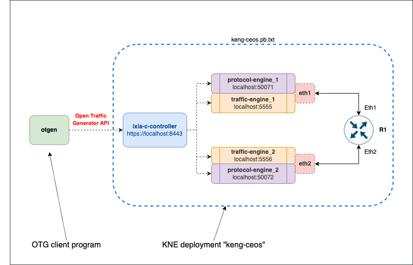

# KNE Lab with BGP and traffic via Arista cEOSLab as a DUT

## Overview

## Lab configuration

### Diagram



### Layer 3 topology and generated traffic flows


# Virtual machine setup examples

## Multipass VM

```Shell
multipass launch 20.04 -n knevm -c8 -m16G -d64G
multipass shell knevm
sudo apt update && sudo apt upgrade -y
sudo apt install build-essential -y
sudo apt install docker.io -y
sudo usermod -aG docker $USER
logout
```

## GCP Instance

```Shell
MYIP=`curl -s ifconfig.me`
MYIPSTR="$(echo $MYIP | sed 's/\./-/g')"

gcloud compute firewall-rules create otg-demo-allow-ssh-${MYIPSTR} --description="Allow tcp 22 ingress to any instance tagged as otg-demo-kne" --direction=INGRESS --priority=1000 --network=default --action=ALLOW --rules=tcp:22 --source-ranges="$MYIP/32" --target-tags=otg-demo-kne

gcloud compute instances create otg-demo-kne \
--subnet=default \
--machine-type=e2-standard-16 \
--image-family=ubuntu-2004-lts \
--image-project=ubuntu-os-cloud \
--boot-disk-size=100GB \
--boot-disk-device-name=otg-demo-kne \
--tags=otg-demo-kne

gcloud compute ssh otg-demo-kne
sudo apt update && sudo apt upgrade -y
sudo apt install build-essential docker.io -y
sudo usermod -aG docker $USER
logout
gcloud compute ssh otg-demo-kne
CR_PAT=YOUR_TOKEN
CR_USERNAME=YOUR_USERNAME
echo $CR_PAT | docker login ghcr.io -u $CR_USERNAME --password-stdin
logout
```

```Shell
gcloud compute ssh otg-demo-kne
git clone -b kne --depth 1 https://github.com/open-traffic-generator/otg-examples.git
cd otg-examples/kne/bgp-ceos
LABDIR=$PWD
make prereqs deploy start
kubectl run otgen --image otgen:local -- sleep 1000000
kubectl exec -it otgen -- /bin/bash
curl -k https://service-https-keng-controller.keng-ceos.svc.cluster.local:8443/capabilities/version
exit
```


```Shell
kubectl exec -it r1 -n keng-ceos -- Cli
en
watch show ip bgp summary
```

Separate SSH session:

```Shell
gcloud compute ssh otg-demo-kne
kubectl exec -it otgen -- /bin/bash
export OTG_API="https://service-https-keng-controller.keng-ceos.svc.cluster.local:8443"
otgen create device -n otg1 -p p1 -l eth1 --ip 192.0.2.1 --prefix 30 --gw 192.0.2.2 | \
otgen add device    -n otg2 -p p2 -l eth2 --ip 192.0.2.5 --prefix 30 --gw 192.0.2.6 | \
otgen add bgp -d otg1 --asn 1111 --route 198.51.100.0/24 | \
otgen add bgp -d otg2 --asn 2222 --route 203.0.113.0/24  | \
otgen add flow -n f-1-2 --tx otg1 --rx otg2 --src 198.51.100.1 --dst 203.0.113.1 --count 1000 --rate 100 --size 128 | \
otgen add flow -n f-2-1 --tx otg2 --rx otg1 --dst 198.51.100.1 --src 203.0.113.1 --count 2000 --rate 200 --size 256 | \
otgen --log info run -k -m flow | otgen transform -m flow | otgen display -m table
exit
```