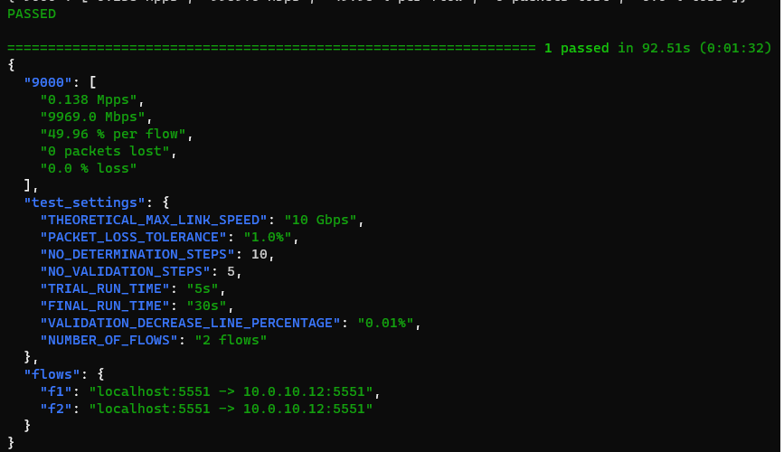

# Ixia-c traffic engine deployment on Amazon Web Services with DPDK

## Overview
This is a public cloud lab where [Ixia-c](https://github.com/open-traffic-generator/ixia-c) has two traffic ports connected within a single subnet of an AWS VPC.
The environment is deployed using [Terraform](https://www.terraform.io/) and [Cloud-Init](https://cloud-init.io/) is used to configure the application and traffic engines.
Performance improvements are enabled through [DPDK](https://www.dpdk.org/) support.
Once the lab is up, a Python script is used to request Ixia-c to generate traffic and report statistics.


## Prerequisites

* This lab requires the commands below to be executed from within [AWS CloudShell](https://docs.aws.amazon.com/cloudshell/latest/userguide/welcome.html).

## Clone the repository

```
git clone --recursive https://github.com/open-traffic-generator/otg-examples.git
```

## Navigate to the lab subdirectory within the repository

```
cd otg-examples/public-cloud/aws/ixia-c-dpdk-aws/
```

## Deploy Ixia-c lab

1. Create Terraform deployment.

2. Wait approximately 6 minutes for infrastructure to be deployed.

3. Execute Python test case to generate traffic between AWS instances.

```
make all
```



## Execute Traffic Test additional times as needed

1. Execute Python test case to generate traffic between AWS instances.

```
make run
```

## Destroy the lab

1. Destroy the Terraform deployment

```
make clean
```